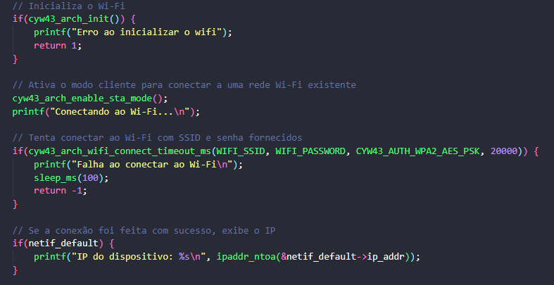
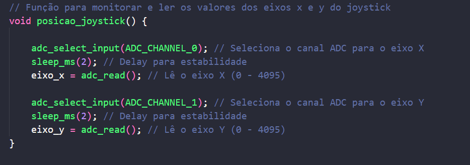
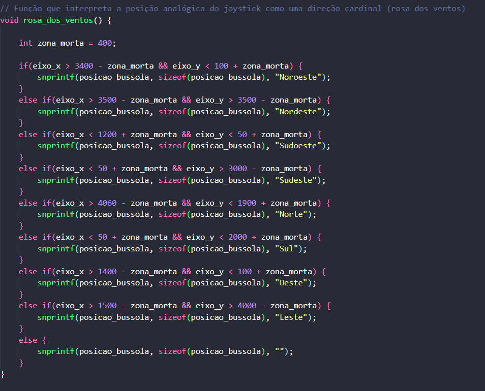
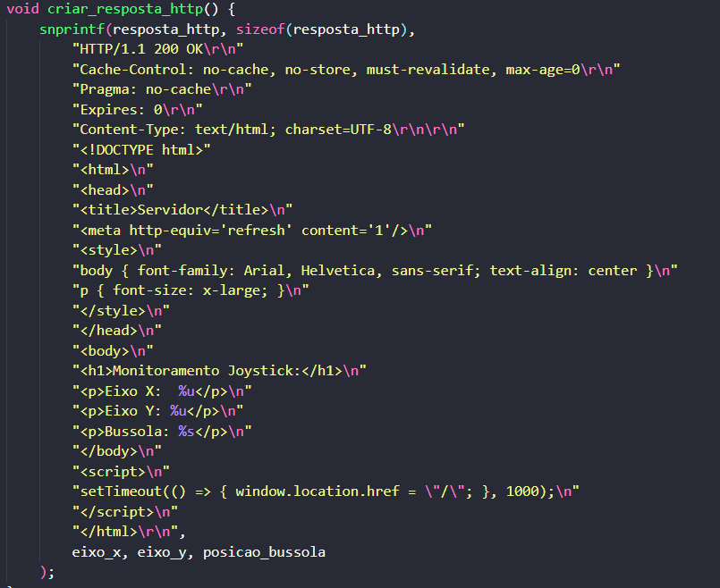

# Servidor Web com Monitoramento do Joystick

Este projeto implementa um servidor web com o Raspberry Pi Pico W que monitora as posições do joystick em tempo real e exibe uma bússola com base nas direções analógicas do joystick.

A página web é atualizada automaticamente a cada segundo com os dados do eixo X, eixo Y e a direção estimada (como Norte, Sul, etc.).

## Hardware Utilizado

- Raspberry Pi Pico W
- Módulo Joystick analógico (ADC 26 e 27)
- Chip Wi-Fi (Infineon CYW43439)

## Funcionalidades

- Conexão à rede Wi-Fi usando o chip CYW43 embutido no Pico W
- Leitura dos valores dos eixos X e Y do joystick via ADC
- Interpretação da direção do joystick como pontos cardeais (rosa dos ventos)
- Servidor HTTP que responde com uma página HTML dinâmica
- Atualização automática da página a cada 1 segundo

## Estrutura do Código

- `Conexão com Wi-Fi`:
  

- `Leitura do Joystick`:
  

- `Rosa dos Ventos`:
  

- `Servidor Web:`
  

## Funções

- `posicao_joystick()`: Lê os valores analógicos dos eixos X e Y do joystick via ADC.
- `rosa_dos_ventos()`: Interpreta os valores lidos e define a direção cardinal correspondente.
- `criar_resposta_http()`: Gera a resposta HTML com os dados atuais.
- `http_callback()`: Callback para responder a requisições HTTP recebidas.
- `connection_callback()`: Callback de conexão para associar a função de resposta HTTP.
- `main()`: Função principal onde o Wi-Fi é configurado, o servidor é iniciado e o monitoramento ocorre continuamente.

## Requisitos

- Placa BitDogLab ou Raspberry Pi Pico W
- SDK do Raspberry Pi Pico instalado
- Ambiente de desenvolvimento C/C++ para o Pico (como o VSCode com CMake)

## Instalação

1. **Clonar o repositório**

```bash
git clone https://github.com/Rafael-Casemiro/Monitoramento_joystick_web_server.git
```

2. **Navegar até o diretório do projeto**

```bash
cd Servidor_Joystick_Web
```

3. **Criar e entrar na pasta de build**

```bash
mkdir build && cd build
```

4. **Gerar arquivos de build com CMake**

```bash
cmake ..
```

5. **Compilar o projeto**

```bash
make
```

6. **Gravar o arquivo .uf2 no Raspberry Pi Pico W**

- Copie o arquivo .uf2 gerado para o Pico W conectado via USB no modo de boot.


